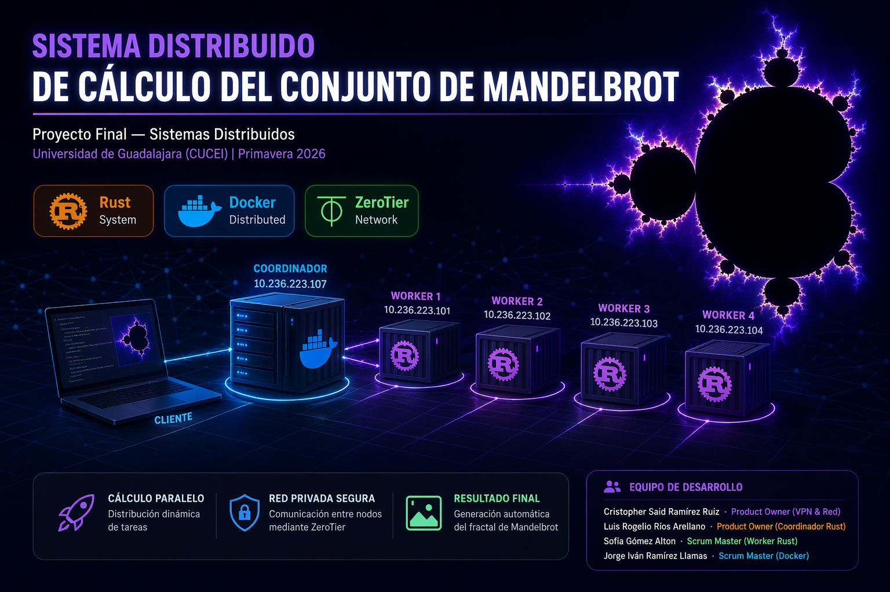
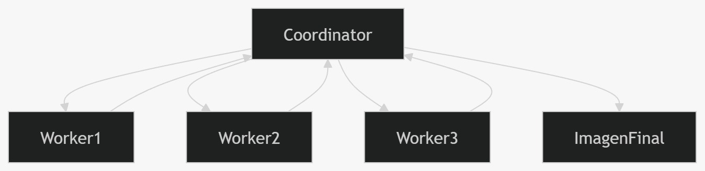
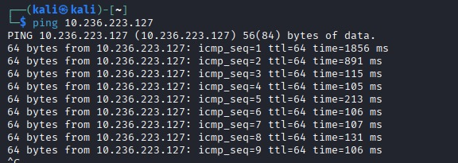
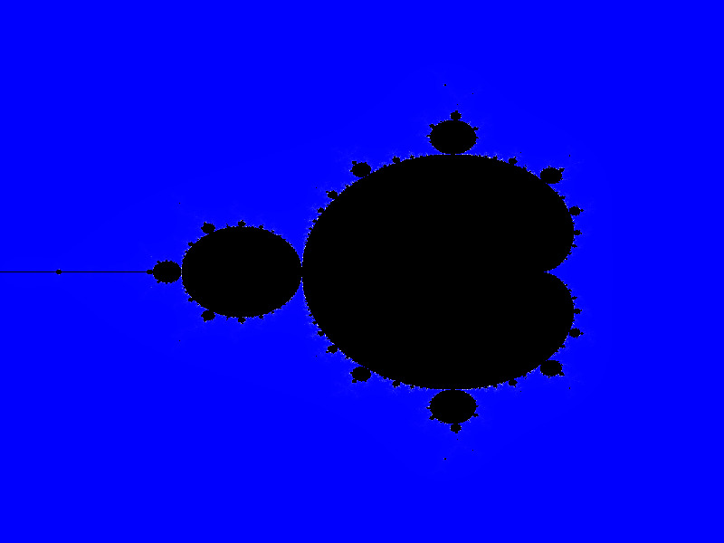
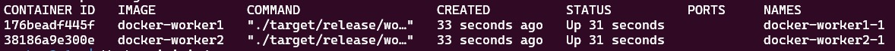
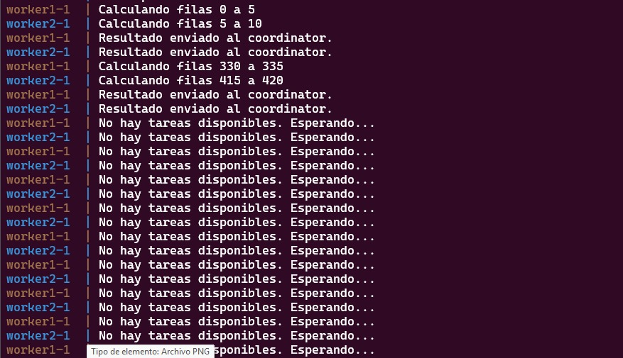
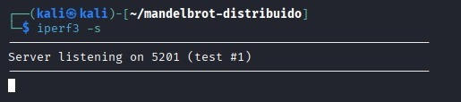
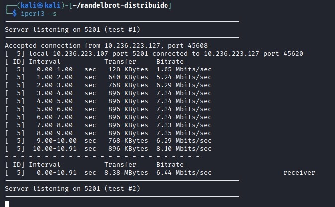
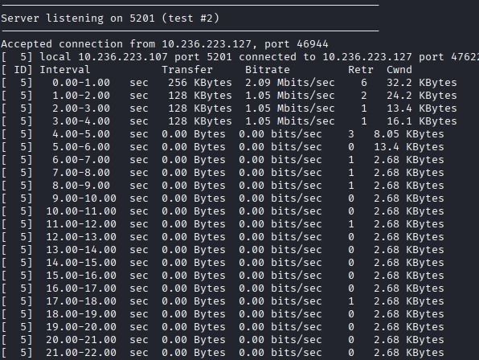

# 🖥️ Sistema Distribuido de Cálculo del Conjunto de Mandelbrot

**Proyecto Final — Sistemas Distribuidos**  
Universidad de Guadalajara (CUCEI) | Primavera 2026

<p align="center">
  
</p>

## 🌐 Demo del Proyecto
👉 https://luisrios6268-spec.github.io/sistema-distribuido-mandelbrot/

## 📑 Tabla de Contenidos

- Descripción
- Características
- Arquitectura
- Tecnologías
- Instalación
- Uso del Sistema
- Verificación
- Pruebas de Rendimiento
- Equipo Scrum
- Resultado Final

---

## 📖 Descripción

Este proyecto implementa un sistema distribuido capaz de generar el fractal de Mandelbrot utilizando múltiples nodos conectados mediante una red virtual privada.

El sistema emplea:

- 🦀 **Rust** → cálculo paralelo de alto rendimiento  
- 🐳 **Docker** → despliegue reproducible  
- 🌐 **ZeroTier** → red privada distribuida entre nodos  
- 📋 **Scrum** → gestión ágil del desarrollo  

El procesamiento se distribuye bajo el modelo **Coordinator-Worker**, permitiendo escalabilidad horizontal.

---

## ✨ Características

- División dinámica de tareas  
- Comunicación segura entre nodos  
- Ejecución distribuida real  
- Escalabilidad por contenedores  
- Generación automática de imagen final  
- Pruebas de rendimiento de red  

---

## 🏗️ Arquitectura del Sistema

Modelo **Maestro-Trabajador** sobre VPN ZeroTier.

### 📸 Diagrama del Sistema

<p align="center">

</p>

---

## 🛠️ Tecnologías Utilizadas

| Tecnología | Uso |
|---|---|
| Rust | Cálculo Mandelbrot |
| Docker | Contenerización |
| Docker Compose | Orquestación |
| ZeroTier | Red privada |
| iperf3 | Pruebas de red |
| GitHub | Control de versiones |

---

## 📋 Requisitos Previos

- Linux / WSL2
- Docker
- Docker Compose
- Git
- ZeroTier One
- Rust (opcional)

---

## 🚀 Instalación y Configuración

### 1️⃣ Clonar repositorio
```bash
git clone https://github.com/luisrios6268-spec/sistema-distribuido-mandelbrot.git

cd sistema-distribuido-mandelbrot
```
2️⃣ Configurar ZeroTier

Instalar:
```bash
curl -s https://install.zerotier.com | sudo bash
```

Unirse a red:

```bash
sudo zerotier-cli join 88c5b1f339bd4e00
```

Verificar:

```bash
zerotier-cli listnetworks
```

Ping entre nodos:

```bash
ping 10.236.223.107
```

<p align="center">

</p>

3️⃣ Despliegue con Docker

Nodo Coordinador:

```bash
docker-compose up -d --scale worker=4
```

Nodo Worker:

Editar:

COORDINATOR_URL=http://10.236.223.107:8080

Luego:

```bash
docker-compose up -d worker
```

🧪 Compilación Manual (Sin Docker)

Coordinator:

```bash
cd coordinator
cargo build --release
cargo run
```

Worker:

``` bash
cd worker
cargo run
```

🎯 Uso del Sistema

Iniciar cálculo:

```bash
curl -X POST http://10.236.223.107:8080/start \
-H "Content-Type: application/json" \
-d '{"width":1920,"height":1080,"max_iter":1000}'
```

Ver logs:

```bash
docker-compose logs -f worker
```

Resultado:

```bash
output/mandelbrot.png
```

<p align="center">

</p>

✅ Verificación del Sistema

Verificar ZeroTier

```bash
zerotier-cli listnetworks
Verificar contenedores
docker ps
```

<p align="center">

</p>

Verificar comunicación Worker

```bash
docker-compose logs worker
```

<p align="center">

</p>

Verificar imagen generada

```bash
ls output/
```

📊 Pruebas de Rendimiento (iperf3)

Servidor:

```bash
iperf3 -s
```

<p align="center">

</p>

Cliente:

```bash
iperf3 -c 10.236.223.107 -t 10
```

<p align="center">

</p>

Reverse Test:

```bash
iperf3 -c 10.236.223.107 -t 10 -R
```

<p align="center">

</p>

📁 Estructura del Proyecto
.
├── coordinator/
├── worker/
├── docker-compose.yml
├── docs/
│   ├── planeacion-scrum.pdf
│   └── evidencias/
└── README.md

👥 Equipo y Roles Scrum

Integrante	Rol	Área
Cristopher Said Ramírez Ruiz	Product Owner	VPN & Red
Luis Rogelio Ríos Arellano	Product Owner	Coordinador Rust
Sofía Gómez Alton	Scrum Master	Worker Rust
Jorge Iván Ramírez Llamas	Scrum Master	Docker

📅 Metodología Scrum
Sprint	Objetivo	Estado
Sprint 1	Red ZeroTier + Rust	✅
Sprint 2	Docker distribuido	✅
Sprint 3	Integración y pruebas	✅ COMPLETADO

## Resultado Final

El sistema logró distribuir exitosamente el cálculo del fractal Mandelbrot
entre múltiples nodos conectados mediante ZeroTier, validando el modelo
Coordinator-Worker en un entorno real distribuido.

Proyecto académico — Universidad de Guadalajara
Licencia MIT.
